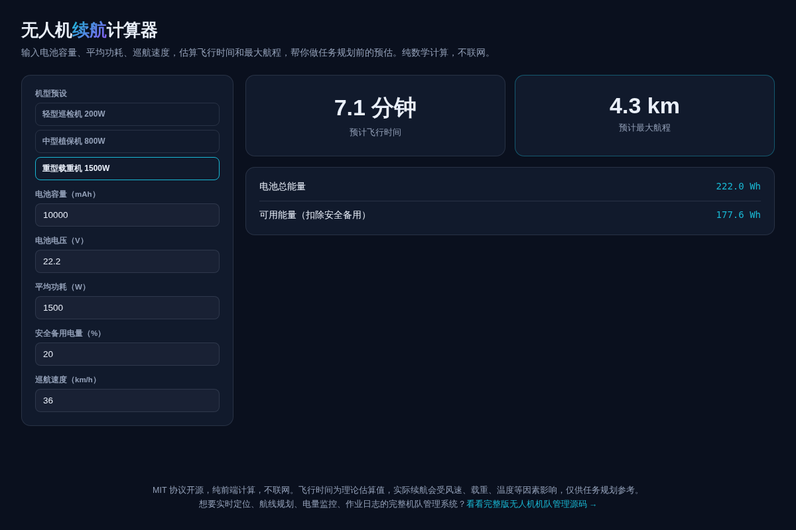

# 无人机续航计算器 · Drone Flight Calculator

**[在线体验 →](https://anna123123123-creator.github.io/drone-flight-calc/)**

免费开源、纯浏览器运行的无人机飞行时间与航程计算器。输入电池容量、电压、平均功耗、安全备用电量和巡航速度，估算飞行时间和最大航程，帮你做任务规划前的预估。纯数学计算，不联网。



## 试用方法

直接用浏览器打开 `index.html`，或用静态文件服务器跑起来：

```bash
python3 -m http.server 8000
```

## 计算公式

```
电池总能量 (Wh) = 容量(mAh) / 1000 × 电压(V)
可用能量 = 电池总能量 × (1 - 安全备用电量%)
飞行时间(分钟) = 可用能量 / 平均功耗(W) × 60
最大航程(km) = 飞行时间(小时) × 巡航速度(km/h)
```

内置轻型巡检机 / 中型植保机 / 重型载重机三档功耗预设，方便快速估算。

**⚠️ 飞行时间为理论估算值，实际续航会受风速、载重、温度等因素影响，仅供任务规划参考，不能替代实际测试。**

## 协议

MIT。

## 需要定制版？

这个工具免费开源、可以直接用。如果你需要的是**改造成适合自己业务的版本**——换品牌、改字段、加功能、接后端或数据库——我可以做。

- **交付周期**：3–10 个工作日
- **交付内容**：完整源码（不加密、可自行二次开发）+ 在线地址 + 部署说明
- **已有 49 套现成系统**可直接改造，覆盖电商、教育、门店、内容、跨境等行业：[全部清单与在线演示](https://inzyxuashop.com)

把你的需求发给我，24 小时内回复可行性与报价：**evcdecd@gmail.com**
